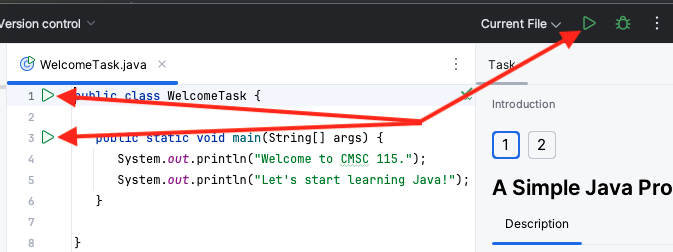

# A Simple Java Program

This project contains weekly code-along lessons designed to
introduce Java programming with the **%IDE_NAME%** Integrated Development Environment (IDE).

Let's start with a simple Java program that prints a welcome message.

- The class  [WelcomeTask](psi_element://WelcomeTask) defines a `main` method, which is automatically called when the program executes. 
- The `main` method contains two statements, each calling the `System.out.println` method to print the quoted string.

There are several ways to execute the `WelcomeTask` class:

- Press `^Ctrl` `R`
- Press the green triangular run button
  - on the task bar
  - on line 1 next to the `WelcomeTask` class
  - on line 3 next to the `main` method
    

Run the program and confirm the text below is displayed. 
It may take a few seconds to build the project before the output appears.

```text
Welcome to CMSC 115.
Let's start learning Java!
```